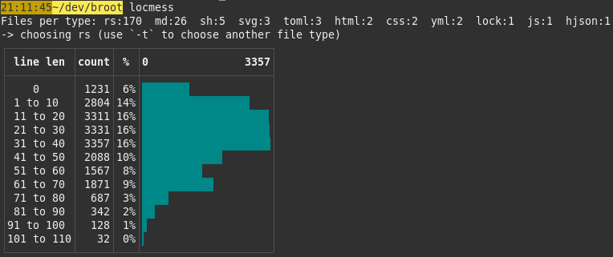
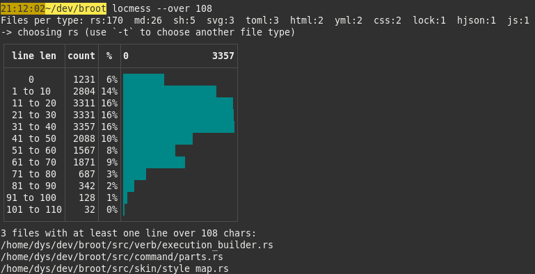

[![Latest Version][s1]][l1] [![MIT][s2]][l2] [![Chat on Miaou][s3]][l3]

[s1]: https://img.shields.io/crates/v/locmess.svg
[l1]: https://crates.io/crates/locmess

[s2]: https://img.shields.io/badge/license-MIT-blue.svg
[l2]: LICENSE

[s3]: https://miaou.dystroy.org/static/shields/room.svg
[l3]: https://miaou.dystroy.org/3768?rust


Do you ever wonder about the distribution of LOC lengths in your source files ?

No ?

I do so I made **LocMess**.



As an answer may bring another question, locmess tries to answer it too:



and if you have yet another question, it's probably for `git blame`.

The source code of **LocMess**, which is totally not messy, may serve as a reasonnable basis for many kinds of transplatformy CLI applications. It's small so there's not much to remove to get to the pure boilerplate.

# Installation

You'll need the rust toolchain, which you may find at https://rustup.rs

Then do

```bash
cargo install locmess
```

# Usage

To compute LOC stats on all not gitignored files in the current directory, do

```bash
locmess
```

You may also pass a path as argument.

Other options are explained with `locmess --help`.


